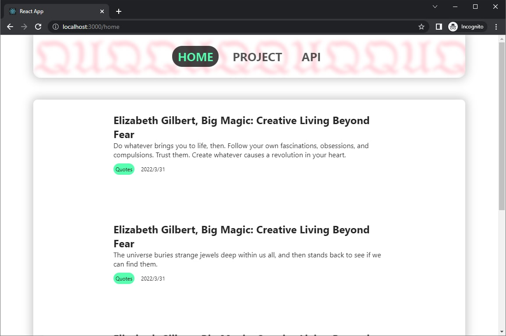

# Karina
`gh-pages`

`react`

`react router`

<p align="center"></p>

### Props
```
    [App]
      |
   [Front]
   |     |
[Card]  [Post]
```

## Deployment
- Run <del>`npm install` and then `npm run build`.</del> `bash deploy.sh`.
- Read [GitHub Pages/Quickstart](https://docs.github.com/en/pages/quickstart) to create a GitHub Page
