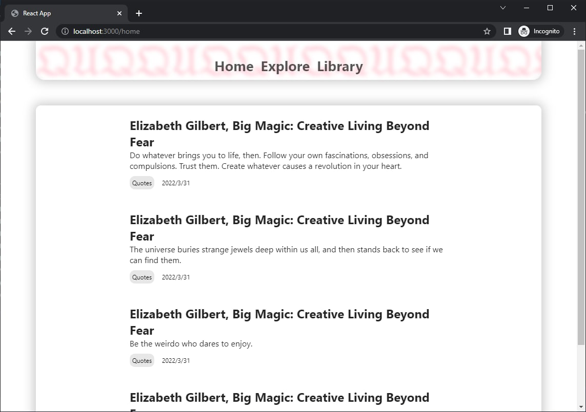

# Karina
`"gh-pages"` + `"react"` + `"react router"`
<<<<<<< HEAD

<p align="center"></p>

GET /display.json parser JSON file
Lazy fetch, do fetch when need data

### Props
```
    [App]
      |
   [Front]
   |     |
[Card]  [Post]
```
=======
<p align="center"></p>
>>>>>>> a590aa5193105b7c7fba75b82f80dd80c6cd2109

## Deployment
- Run <del>`npm install` and then `npm run build`.</del> `bash deploy.sh`.
- Read [GitHub Pages/Quickstart](https://docs.github.com/en/pages/quickstart) to create a GitHub Page
